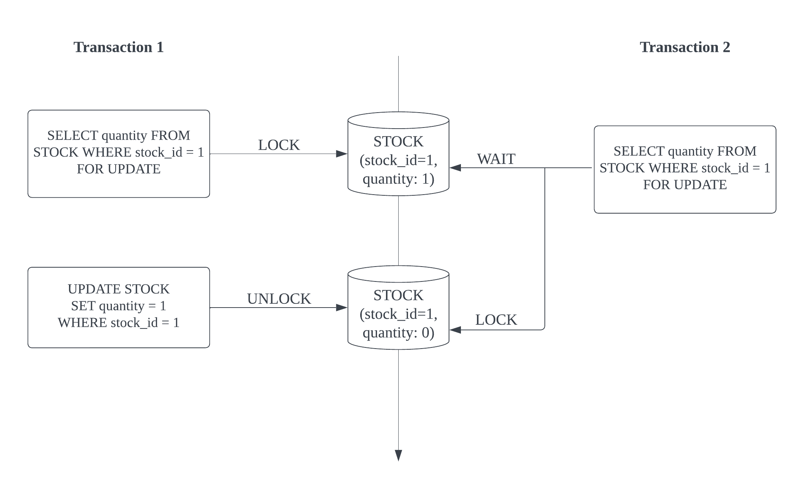
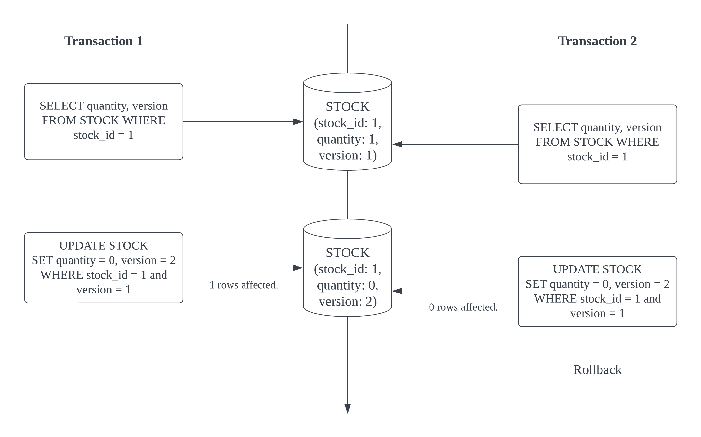
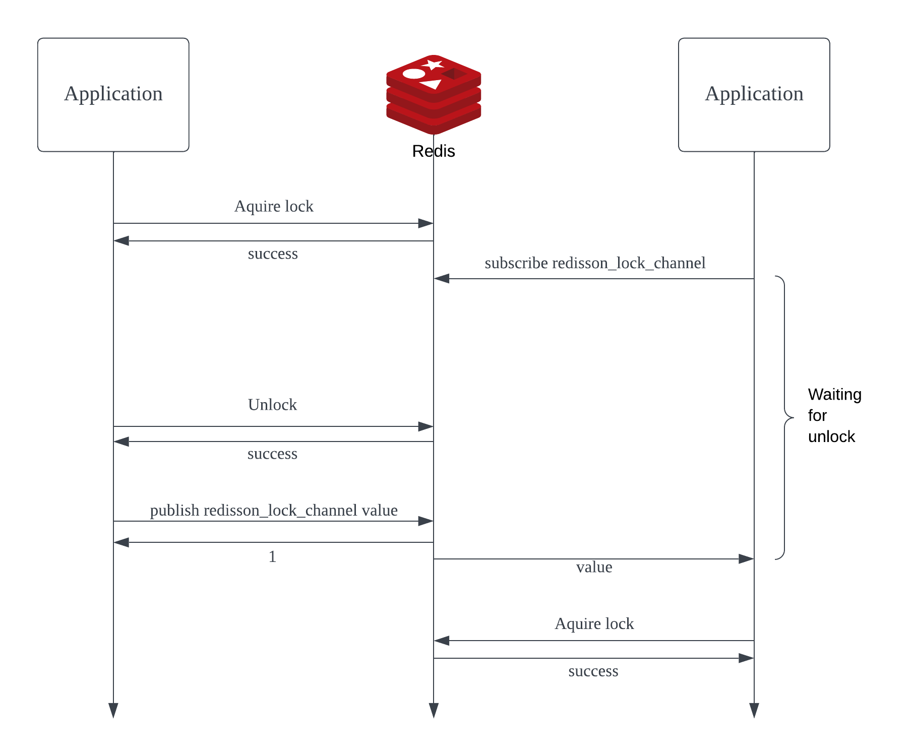
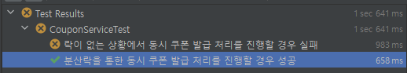
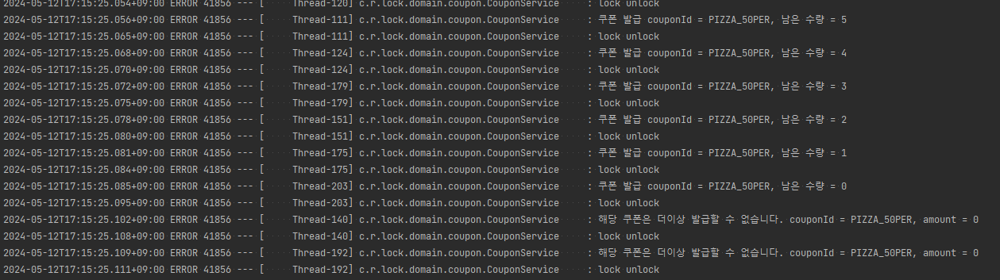

## **Redis 분산락**

Redis의 분산락에 대해서 알아보도록 하겠다. 락은 데이터 동시성 제어를 위해 필요하다. 그렇다면 왜 Redis 분산락을 사용해야하는지? 다른 방식으로 제어할 수는 없는지 알아보고 최종적으로 분산락의 사용법까지 알아보자.

## **데이터 동시성 제어**

데이터의 동시성 제어(Concurrency Control)란, 여러 쓰레드가 하나의 데이터에 접근할 때 데이터의 일관성을 보장하고 데이터의 무결성을 유지해야 하는 제어 방식을 의미한다. 이러한 조건을 만족하며 시스템의 성능과 효율을 유지해야 하는 것 또한 중요한 포인트이다.

## **데이터 동시성 제어 방법**

1. synchronized
2. Database Lock
3. Distributed Lock

위 3가지의 방법으로 데이터 동시성에 대한 처리를 진행할 수 있다. 

### **synchronized**

synchronized는 애플리케이션 내부에서 여러 쓰레드에 대한 접근을 순차적으로 처리하여 동시성을 제어할 수 있다. @Synchronized 어노테이션이나 메소드의 반환형 앞에 synchronized 키워드를 선언하여 사용할 수 있다.

**애플리케이션 내부에서 쓰레드의 접근을 순차적으로 제어하기 때문에 분산 서버 환경에서는 데이터 동시성 제어가 불가능**하다.

### **Database Lock**

Database Lock은 데이터베이스에 Lock을 사용하여 동시성 제어를 할 수 있다. 비관적 락(Pessimisitc Lock), 낙관적 락(Optimistic Lock) 동시성을 제어한다.

#### **비관적 락 (Pessimisitc Lock)**

해당 데이터의 동시성 문제가 빈번하게 일어난다는 조건이 성립될 경우 사용되는 기술이다. 데이터를 읽거나 수정하기 전에 Lock을 획득하여 다른 사용자의 접근을 차단하고 Lock을 가진 쓰레드만 접근하도록 제어한다. RBDMS(MySQL, Oracle, PostgreSQL 등)에서는 `SELECT ~ FOR UPDATE` 와 같은 SQL문장으로 update가 완료되어 커밋할 때까지 다른 트랜잭션에서 데이터에 접근을 할 수 없는 기능을 제공한다.



JPA에서는 `@Lock(LockModeType.PESSIMISTIC_WRITE)` 로 비관적 락을 사용할 수 있다.

데이터의 동시성 문제가 빈번하게 일어난다면 확실하게 동시성을 제어할 수 있다는 장점이 있다. 반대로 데드락이 발생할 수 있고 해당 데이터에 Lock을 걸어 처리하기 때문에 여러 쓰레드의 접근이 이뤄질 경우 성능이 떨어질 수 있다.

#### **낙관적 락(Optimistic Lock)**

낙관적락은 실제 Lock을 이용하는 방식이 아닌 버전과 같은 컬럼을 추가하여 데이터의 정합성을 맞추는 방법이다. 동시성 이슈가 자주 발생하지 않을 것으로 판단되는 조건에서 사용하고 버전을 통한 데이터 정합성의 이슈가 발생할 경우 예외를 발생시켜 정합성을 맞출 수 있도록 한다.



데이터에 Lock을 거는 방식이 아니기 때문에 비관적 락에 비해 성능상으로 빠르다. 반대로 동시성 이슈가 자주 발생할 경우 예외가 빈번하게 발생하고 후처리는 개발자가 처리해야 한다는 단점이 있다.

위 2가지 Database Lock은 Database를 기준으로 동작하기 때문에 분산 Database 환경에서는 사용할 수 없다.

### **Distributed Lock**

Distributed Lock은 분산 시스템에서의 동시성 문제를 해결하기 위해 사용되며, 분산된 서버 간의 공유된 자원을 통해 엑세스를 제어한다.
대표적으로 분산락을 활용할 수 있는 시스템은 Zookeeper, Redis가 있는데 이번엔 Redis의 Redisson의 RedLock 으로 분산락을 통한 동시성 제어를 확인한다.

#### **Redisson 을 사용한 분산락**

Redisson은 pub/sub과 Lua 스크립트를 활용해 효과적으로 분산락을 처리하는 기능을 제공한다.

pub/sub 기능을 활용하여 락을 획득할 때까지 subscribe로 채널의 메시지를 기다린다. 이후 unlock이 발생하여 채널의 메시지가 publish 되면 락 획득을 시도한다.



```java
<T> RFuture<T> tryLockInnerAsync(long waitTime, long leaseTime, TimeUnit unit, long threadId, RedisStrictCommand<T> command) {  
    return evalWriteSyncedAsync(getRawName(), LongCodec.INSTANCE, command,  
            "if ((redis.call('exists', KEYS[1]) == 0) " +  
                        "or (redis.call('hexists', KEYS[1], ARGV[2]) == 1)) then " +  
                    "redis.call('hincrby', KEYS[1], ARGV[2], 1); " +  
                    "redis.call('pexpire', KEYS[1], ARGV[1]); " +  
                    "return nil; " +  
                "end; " +  
                "return redis.call('pttl', KEYS[1]);",  
            Collections.singletonList(getRawName()), unit.toMillis(leaseTime), getLockName(threadId));  
}
```

Lua Script를 통해 명령어의 집합을 원자적으로 실행할 수 있어 Lock, Unlock의 명령을 원자적으로 실행한다.

#### **Redisson을 활용한 분산락 적용**

##### **개발 목표**

제한적인 수량의 쿠폰을 발급하는 서비스를 개발한다. 동시성 접근이 일어나는 상황을 만들고 분산락을 적용한 서비스와 그렇지 않은 서비스의 테스트 결과를 확인한다. 

##### **의존성 추가**
```
implementation 'org.redisson:redisson-spring-boot-starter:{타겟 버전}'
```
Redisson 의존성 추가

##### **application.yml 설정**

```application.yml
spring:  
  data:  
    redis:  
      host: localhost  
      port: 6379
```

Redis 접속 정보 설정

##### **개발 내용**

**Coupon**
```java
@Builder  
public record Coupon(  
   String couponId,  
   Integer couponCount  
) {  
   public static Coupon createCoupon(String couponId, Integer couponCount) {  
      return Coupon.builder()  
            .couponId(couponId)  
            .couponCount(couponCount)  
            .build();  
   }  
}
```

**CouponService**
```java
@Slf4j  
@Service  
@RequiredArgsConstructor  
public class CouponService {  
  
   private final RedissonClient redissonClient;  
  
   private final ConcurrentHashMap<String, Integer> couponData = new ConcurrentHashMap<>();  
  
   //쿠폰 데이터를 set
    public Coupon setCoupon(final String couponId, final Integer couponCount) {  
      Coupon coupon = Coupon.createCoupon(couponId, couponCount);  
      couponData.put(coupon.couponId(), couponCount);  
      return coupon;  
   }  
  
   public int getRemainCountCount(final String couponId) {  
      return couponData.get(couponId);  
   }  
  
   //generateCoupon이 될때마다 해당 쿠폰의 수에서 감소  
   public void generateCoupon(final String couponId) {  
      int amount = couponData.getOrDefault(couponId, 0);  
      if(amount <= 0) {  
         log.error("해당 쿠폰은 더이상 발급할 수 없습니다. couponId = %s, amount = %d".formatted(couponId, amount));  
         return;      }  
      log.error("쿠폰 발급 couponId = %s, 남은 수량 = %d".formatted(couponId, --amount));  
      setCoupon(couponId, amount);  
   }  
  
   public void generateCouponWithLock(final String couponId) {  
      final RLock lock = redissonClient.getLock(String.format("COUPONLOCK:%s", couponId));  
  
      try {  
         lock.tryLock(3, 2, TimeUnit.SECONDS);  
         generateCoupon(couponId);  
      } catch (InterruptedException e) {  
         log.error("lock.tryLock %s".formatted(e));  
      } finally {  
         lock.unlock();  
         log.error("lock unlock");  
      }  
   }  
}
```

- 별도의 데이터베이스를 이용하지 않고 ConcurrentHashMap으로 데이터를 관리
- setCoupon에 couponId와 쿠폰 발행 개수를 전달하여 데이터 저장
- generateCoupon에 해당 쿠폰 ID를 전달하면 해당 쿠폰이 발급되며 수량 감소
- 발급 수량이 0 이하일 경우 발급 불가
- generateCouponWithLock은 분산락을 통한 처리 메소드

tryLock 의 동작을 알아보자.
```java
boolean tryLock(long waitTime, long leaseTime, TimeUnit unit) throws InterruptedException;
```
- waitTime - Lock을 요청할 때까지 대기하는 시간
- leaseTime - 해당 시간이 지나면 Lock 해제

**CouponServiceTest**
```java
@SpringBootTest  
class CouponServiceTest {  
  
   @Autowired  
   private CouponService couponService;  
  
   String couponId;  
  
   @BeforeEach  
   void testStart() {  
      couponId = "PIZZA_50PER";  
      couponService.setCoupon(couponId, 50);  
   }  
  
   @Test  
   @DisplayName("락이 없는 상황에서 동시 쿠폰 발급 처리를 진행할 경우 실패")  
   void generateCoupon_Test_Fail() throws InterruptedException {  
      final int people = 100;  
      final CountDownLatch countDownLatch = new CountDownLatch(people);  
  
      List<Thread> userThread = Stream  
            .generate(() -> new Thread(new UserExecutor(couponId, countDownLatch, o -> couponService.generateCoupon(couponId))))  
            .limit(people)  
            .collect(Collectors.toList());  
      userThread.forEach(Thread::start);  
      countDownLatch.await();  
  
      final int remainCouponCount = couponService.getRemainCountCount(couponId);  
      assertEquals(remainCouponCount, 0);  
   }  
  
   @Test  
   @DisplayName("분산락을 통한 동시 쿠폰 발급 처리를 진행할 경우 성공")  
   void generateCouponWithLock_Test_Success() throws InterruptedException {  
      final int people = 100;  
      final CountDownLatch countDownLatch = new CountDownLatch(people);  
  
      List<Thread> userThread = Stream  
            .generate(() -> new Thread(new UserExecutor(couponId, countDownLatch, o -> couponService.generateCouponWithLock(couponId))))  
            .limit(people)  
            .collect(Collectors.toList());  
      userThread.forEach(Thread::start);  
      countDownLatch.await();  
  
      final int remainCouponCount = couponService.getRemainCountCount(couponId);  
  
      assertEquals(remainCouponCount, 0);  
   }  
}
```

- @BeforeAll 로 각 Test 메소드가 실행되기 전 쿠폰 발급 수량을 50으로 설정
- 100명의 사람들이 쿠폰을 발급받기 위해 쓰레드를 통해 동시 접근
- 분산락을 사용한 / 사용하지 않은 메소드로 분리하여 테스트 진행

**UserExecutor**

```java
public class UserExecutor implements Runnable{  
  
   private String couponId;  
   private CountDownLatch countDownLatch;  
   private Consumer<String> consumer;  
  
   public UserExecutor(String couponId, CountDownLatch countDownLatch, Consumer<String> consumer) {  
      this.couponId = couponId;  
      this.countDownLatch = countDownLatch;  
      this.consumer = consumer;  
   }  
  
   @Override  
   public void run() {  
      consumer.accept(couponId);  
      countDownLatch.countDown();  
   }  
}
```

- 사용자가 쿠폰을 발행하는 Runnable class 구현

##### **결과**





- 분산락을 적용한 테스트 메소드는 성공하였고 아닌 경우는 쿠폰 발행 갯수가 0으로 떨어지지 않아서 실패하였다.

### **마치며**

데이터 동시성 제어에 관련한 내용을 알아보고 분산 환경(서버, Database)에서 활용 가능한 Redisson 분산락에 대해서 알아보았다. 데이터 동시성에 대한 해결 방안은 여러가지가 있으며 구성된 환경과 해결하고자 하는 이슈, 성능에 따라 다양한 해결방안을 정리하는 시간이였다. 

### **Github**
<https://github.com/inturn86/redis-distributed-lock>

### **참고자료**
<https://velog.io/@yellowsunn/%EB%8F%99%EC%8B%9C%EC%84%B1-%EC%9D%B4%EC%8A%88%EB%A5%BC-%ED%95%B4%EA%B2%B0%ED%95%98%EB%8A%94-%EB%8B%A4%EC%96%91%ED%95%9C-%EB%B0%A9%EB%B2%95>