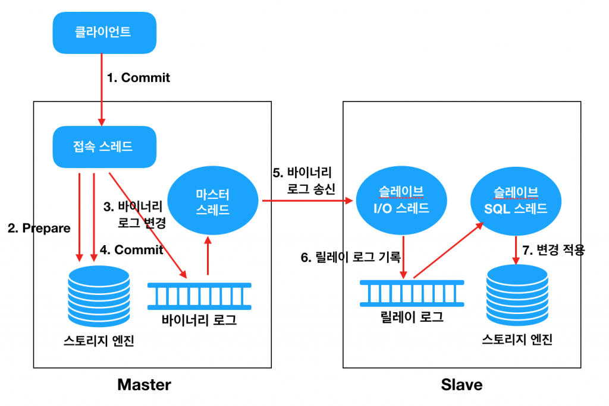

## **데이터베이스 Replication 이란?**

데이터베이스 Replication이란 데이터베이스 별 권한을 두어 Master와 Slave로 관리하는 방식이다. Master에서는 쓰기 작업 만을 처리하며 Slave에서는 읽기 작업 만을 처리한다. 일반적인 애플리케이션 서비스는 DB의 70~80%가 읽기 요청이다. 그렇기 때문에 Replication을 통한 성능 향상을 기대할 수 있다. MySQL에서 어떠한 방식으로 Replication을 처리하며 구성하는 방식을 알아보자. 그리고 실제 프로젝트에 반영하여 확인하는 작업을 진행해보자.


## **MySQL Replication 동작 원리**

MySQL 의 Replication 은 기본적으로 비동기 복제 방식을 사용하고 있다.  
Master 노드에서 변경되는 데이터에 대한 이력을 로그에 기록하면, Replication Master Thread 가 (**비동기적으로**) 이를 읽어서 Slave 쪽으로 전송하는 방식이다.

MySQL 에서 Replication 을 위해 반드시 필요한 요소는 다음과 같다.

- **Master 에서의 변경을 기록하기 위한 Binary Log**
- **Binary Log 를 읽어서 Slave 쪽으로 데이터를 전송하기 위한 Master Thread**
- **Slave 에서 데이터를 수신하여 Relay Log 에 기록하기 위한 I/O Thread**
- **Relay Log 를 읽어서 해당 데이터를 Slave 에 Apply(적용)하기 위한 SQL Thread**

위의 구성 요소들은 아래 그림에서 보는 Flow 대로 데이터 복제를 수행한다.



1. 클라이언트(Application)에서 Commit 을 수행한다.
2. Connection Thread 는 스토리지 엔진에게 해당 트랜잭션에 대한 Prepare(Commit 준비)를 수행한다.
3. Commit 을 수행하기 전에 먼저 Binary Log 에 변경사항을 기록한다.
4. 스토리지 엔진에게 트랜잭션 Commit 을 수행한다.
5. Master Thread 는 시간에 구애받지 않고(비동기적으로) Binary Log 를 읽어서 Slave 로 전송한다.
6. Slave 의 I/O Thread 는 Master 로부터 수신한 변경 데이터를 Relay Log 에 기록한다. (기록하는 방식은 Master 의 Binary Log 와 동일하다)
7. Slave 의 SQL Thread 는 Relay Log 에 기록된 변경 데이터를 읽어서 스토리지 엔진에 적용한다.

## **MySQL Replication 구성**

MySQL Replication을 구성해보자. 2대의 가상 서버 환경을 구축하고 MySQL을 설치하여 진행하겠다. 만약 master, slave의 데이터베이스가 동일하지 않다면 Replication을 구성하기 전 복원하여 동일하게 구성하도록 하자.

#### **실습환경**

```
Ubuntu 18.04
MySQL 5.7.42
```

#### **1. master 서버 설정**

아래 MySQL 설정 파일을 수정한다.
```bash
$ sudo vi /etc/mysql/mysql.conf.d/mysqld.cnf
```

```
[mysqld]
max_allowed_packet=1000M
server-id = 1
log-bin = mysql-bin
binlog_format = ROW
max_binlog_size = 500M
sync_binlog = 1
expire-logs-days = 7
```

- **server-id** : MySQL 서버 ID로, Master, Slave는 구별되어야 한다.
- **log-bin** : 바이너리 로그 파일 경로
- **binlog_format** : 바이너리 로그의 저장 형식을 지정한다. `STATEMENT` , `ROW` , `MIXED` 이 3가지 중 하나를 선택할 수 있다.

위와 같이 설정을 변경 후 restart 한다.

```bash
$ systemctl restart mysql.service
```

master의 status 정보를 조회하여 File, Position 정보를 확인한다.

```sql
SHOW MASTER STATUS \G
```

```
*************************** 1. row ***************************
             File: mysql-bin.000001
         Position: 627
     Binlog_Do_DB:
 Binlog_Ignore_DB:
Executed_Gtid_Set:
1 row in set (0.00 sec)
```

slave 서버의 계정 정보를 등록한다.

```sql
CREATE USER '{slave서버 유저ID}'@'{slave 서버 IP}' IDENTIFIED BY '{비밀번호}';
GRANT REPLICATION SLAVE ON *.* TO '{slave서버 유저ID}'@'{slave 서버 IP}';
```

#### **2. slave 서버 설정**

master와 마찬가지로 MySQL 설정 파일을 수정한다.
```bash
$ sudo vi /etc/mysql/mysql.conf.d/mysqld.cnf
```

```
[mysqld]
max_allowed_packet=1000M
server-id = 2
log-bin = mysql-bin
binlog_format = ROW
max_binlog_size = 500M
sync_binlog = 1
expire-logs-days = 7
```

위와 같이 설정을 변경 후 restart 한다.

```bash
$ systemctl restart mysql.service
```

Replication을 위해 MySQL에 접속하여 아래 sql을 실행한다.
MASTER_LOG_POS는 master에서 조회한 position을 입력하고, MASTER_LOG_FILE는 file을 입력한다. 

```sql
CHANGE MASTER TO MASTER_HOST="{master IP}", MASTER_PORT=3306, MASTER_USER="{master 사용자 ID}", MASTER_PASSWORD="{master 사용자 PW}", MASTER_LOG_FILE="mysql-bin.000001", MASTER_LOG_POS=627;
```

아래 명령을 입력하면 Replication이 시작되고 아래와 같은 상태를 확인할 수 있다.
```sql
START slave;
```

```
               Slave_IO_State: Waiting for master to send event
                  Master_Host: xxx.xxx.xxx.xxx
                  Master_User: sdc
                  Master_Port: 3306
                Connect_Retry: 60
              Master_Log_File: mysql-bin.000001
          Read_Master_Log_Pos: 7543
               Relay_Log_File: mysql-replication-slave-relay-bin.000004
                Relay_Log_Pos: 3916
        Relay_Master_Log_File: mysql-bin.000001
             Slave_IO_Running: Yes
            Slave_SQL_Running: Yes
              Replicate_Do_DB:
          Replicate_Ignore_DB:
           Replicate_Do_Table:
       Replicate_Ignore_Table:
      Replicate_Wild_Do_Table:
  Replicate_Wild_Ignore_Table:
                   Last_Errno: 0
                   Last_Error:
                 Skip_Counter: 0
          Exec_Master_Log_Pos: 7543
              Relay_Log_Space: 4582
              Until_Condition: None
               Until_Log_File:
                Until_Log_Pos: 0
           Master_SSL_Allowed: No
           Master_SSL_CA_File:
           Master_SSL_CA_Path:
              Master_SSL_Cert:
            Master_SSL_Cipher:
               Master_SSL_Key:
        Seconds_Behind_Master: 0
Master_SSL_Verify_Server_Cert: No
                Last_IO_Errno: 0
                Last_IO_Error:
               Last_SQL_Errno: 0
               Last_SQL_Error:
  Replicate_Ignore_Server_Ids:
             Master_Server_Id: 1
                  Master_UUID: 4f2178ec-0d40-11ef-8e74-f220cd68424f
             Master_Info_File: /var/lib/mysql/master.info
                    SQL_Delay: 0
          SQL_Remaining_Delay: NULL
      Slave_SQL_Running_State: Slave has read all relay log; waiting for more updates
           Master_Retry_Count: 86400
                  Master_Bind:
      Last_IO_Error_Timestamp:
     Last_SQL_Error_Timestamp:
               Master_SSL_Crl:
           Master_SSL_Crlpath:
           Retrieved_Gtid_Set:
            Executed_Gtid_Set:
                Auto_Position: 0
         Replicate_Rewrite_DB:
                 Channel_Name:
           Master_TLS_Version:

```

위 Replication 상태를 확인하고 싶다면 아래 sql을 실행하면 된다.
```sql
SHOW SLAVE STATUS \G;
```

이제 master의 데이터가 slave에 동기화 되는 것을 확인할 수 있다.
Spring boot 프로젝트를 통해 @Transactional(readOnly = true) 일 경우 slave의 데이터를 조회, @Transactional일 경우 master에 CUD 하는 구성을 해보자.

## **SpringBoot 프로젝트 구성**

#### **구성환경**

```
Spring boot 3.2.5
Zulu 17
JPA
```

#### **의존성 추가**

```
implementation 'org.springframework.boot:spring-boot-starter-data-jpa'  
implementation 'org.springframework.boot:spring-boot-starter-web'  
runtimeOnly `com.mysql:mysql-connector-j`
```

#### **application.yml**

기본 DataSource가 아닌 master, slave를 구별하여 설정한다.

```yml
spring:  
  application:  
    name: mysql-replication  
  datasource:  
    master:  
      hikari:  
        username: ${master 계정 ID}  
        password: ${master 계정 pw}  
        driver-class-name: com.mysql.cj.jdbc.Driver  
        jdbc-url: jdbc:mysql://xxx.xxx.xxx.xxx:3306/replication  
    slave:  
      hikari:  
        username: ${master 계정 ID}  
        password: ${master 계정 pw}
        driver-class-name: com.mysql.cj.jdbc.Driver  
        jdbc-url: jdbc:mysql://xxx.xxx.xxx.xxx:3306/replication  
  jpa:  
    hibernate:  
      ddl-auto: update  
  
    properties:  
      hibernate:  
        show_sql: true  
        format_sql: true
```

#### **DataSourceConfiguration 설정**

```java
@Configuration  
public class DataSourceConfiguration {  
  
   @Bean(DatabaseConsts.MASTER_SERVER)  
   @ConfigurationProperties(prefix = "spring.datasource.master.hikari")  
   public DataSource masterDataSource() {  
      return DataSourceBuilder.create()  
            .type(HikariDataSource.class)  
            .build();  
   }  
  
   @Bean(DatabaseConsts.SLAVE_SERVER)  
   @ConfigurationProperties(prefix = "spring.datasource.slave.hikari")  
   public DataSource slaveDataSource() {  
      return DataSourceBuilder.create()  
            .type(HikariDataSource.class)  
            .build();  
   }  
  
   @Bean  
   public DataSource routingDataSource(  
         @Qualifier(DatabaseConsts.MASTER_SERVER) DataSource masterDataSource,  
         @Qualifier(DatabaseConsts.SLAVE_SERVER) DataSource slaveDataSource  
   ) {  
      RoutingDataSource routingDataSource = new RoutingDataSource();  
  
      HashMap<Object, Object> dataSourceMap = new HashMap<>();  
      dataSourceMap.put(DatabaseConsts.MASTER_SERVER, masterDataSource);  
      dataSourceMap.put(DatabaseConsts.SLAVE_SERVER, slaveDataSource);  
  
      routingDataSource.setTargetDataSources(dataSourceMap);  
      routingDataSource.setDefaultTargetDataSource(masterDataSource);  
  
      return routingDataSource;  
   }  
  
   @Bean  
   @Primary
   public DataSource dataSource(@Qualifier("routingDataSource") DataSource routingDataSource) {  
      DataSource determinedDataSource = routingDataSource(masterDataSource(), slaveDataSource());  
      return new LazyConnectionDataSourceProxy(determinedDataSource);  
   }
```

`@ConfigurationProperties` 을 사용해 `application.yml`에 설정 정보를 `@Bean`에 매핑한다. master, slave로 구분하여 `DataSource`를 등록한다.

`routingDataSource`에서 위 등록한 master, slave `DataSource`를 Map으로 등록하고 이를 `@Bean`으로 등록한다.

`dataSource`는 `routingDataSource`에 설정한 정보를 Spring boot 전반에 사용될 `@Bean`으로 등록한다. 

Spring은 트랜잭션에 진입된 순간 바로 `DataSource` 를 가져오고, 커넥션을 획득한다. 그리고 그 다음에 트랜잭션의 현재 상태가 저장된다. 즉, `TransactionSynchronizationManager`에 트랜잭션 정보를 동기화 하는 작업은 `DataSource`로부터 Connection을 얻어온 이후 동작한다.

따라서 `LazyConnectionDataSourceProxy` 라는 클래스를 사용하여 트랜잭션에 진입한 시점이 아니라, 실제 쿼리가 시작된 시점에 `DataSource` 를 선택하도록 지연시킨다.

#### **RoutingDataSource 설정**

```java
public class RoutingDataSource extends AbstractRoutingDataSource {  
   @Override  
   protected Object determineCurrentLookupKey() {  
      boolean isReadOnly = TransactionSynchronizationManager.isCurrentTransactionReadOnly();  
  
      System.out.println("Transaction의 Read Only가 " + isReadOnly + " 입니다.");  
  
      if (isReadOnly) {  
         System.out.println("Slave 서버로 요청합니다.");  
         return DatabaseConsts.SLAVE_SERVER;  
      }  
      else {  
         System.out.println("Master 서버로 요청합니다.");  
         return DatabaseConsts.MASTER_SERVER;  
      }  
   }  
}
```

`AbstractRoutingDataSource` 라는 추상 클래스를 통해 멀티 DataSource 환경을 묶고 분기할 수 있다.

`AbstractRoutingDataSource` 의 `setTargetDataSources()`라는 메소드를 통해 Map을 전달한다. 이때 Map의 Value로는`DataSource`를 전달한다. 전달된 `DataSource` 는 Map의 Key를 통해 찾을 수 있다. 여기서는 Key를 String 타입으로 사용할 것이다.

`AbstractRoutingDataSource` 를 상속받는 구체 클래스 `RoutingDataSource` 를 구현하고,`determineCurrentLookupKey()` 메소드를 오버라이드하여 트랜잭션의 readOnly 값에 따라 다른 `DataSource` Key를 반환하도록 한다.

#### **결과**

간단한 사용자 Entity를 구성하여 저장 조회하는 테스트를 진행한다.

```log
Hibernate: 
    insert 
    into
        user
        (password, user_name) 
    values
        (?, ?)
Transaction의 Read Only가 false 입니다.
Master 서버로 요청합니다.
```

```log
Hibernate: 
    select
        u1_0.user_id,
        u1_0.password,
        u1_0.user_name 
    from
        user u1_0 
    where
        u1_0.user_id=?
Transaction의 Read Only가 true 입니다.
Slave 서버로 요청합니다.
```

### **마치며**

MySQL Replication 구현을 위한 MySQL 구성, Spring Boot 프로젝트 구성을 진행하였다. Replication 목적은 읽기 / 쓰기를 분리하여 애플리케이션의 성능 향상을 기대할 수 있다는 점이다. 하지만 Replication이 비동기로 진행되기에 시점에 따라 데이터의 부정합이 발생할 수 있다는 단점을 가지고 있다. 그렇기에 부정합이 발생하지 않아야 하는 애플리케이션이라면 이를 보완할 수 있는 대응 방안이 필요하다.

### **Github**
<https://github.com/inturn86/mysql-replication>

### **참고자료**

<https://hudi.blog/database-replication-with-springboot-and-mysql/>

<http://cloudrain21.com/mysql-replication>
